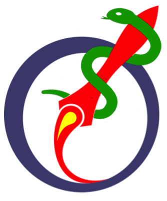

# uORocketry CAN-RGX 2021

  

This is the uORocketry code for the 2021 Canadian Reduced Gravity Experiment Design Challenge (CAN-RGX).

This repository consists of the code of three components:
- Raspberry Pi (mainRPI.py): In charge of monitoring the experiment and controlling various components on user request.
- Laptop (mainLaptop.py): Connects to the RPi and provides a GUI to the user for monitoring and controlling the experiment.
- Teensy (teensy/): Communicates with the RPi. Controls and monitors the motors and photodidodes

Together, these components control and monitor a heater, motors, high-powered LEDs, and sensors.